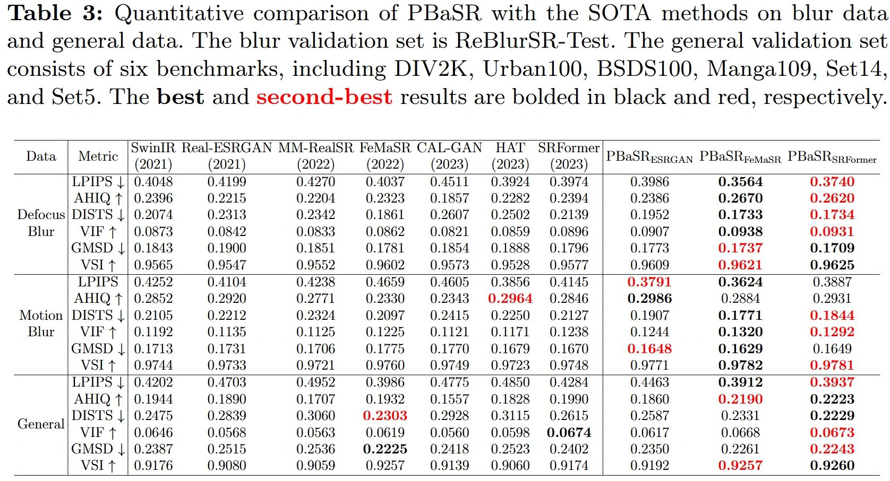
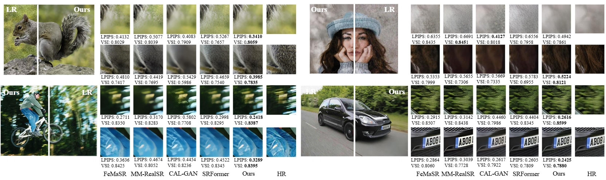

# PBaSR

This is the PyTorch Repository for the paper
[A New Dataset and Framework for Real-World Blurred Images Super-Resolution](https://arxiv.org/abs/2407.14880) 

[](https://arxiv.org/abs/2407.14880)




## Basic Dependencies

- Ubuntu >= 20.04
- CUDA >= 11.1
- Python 3.8

## Installation
```bash
# git clone this repository
git clone 
cd PBaSR

# create new anaconda env 
conda create -n PBaSR python=3.8    
conda activate PBaSR                

# install python dependencies
pip3 install -r requirements.txt
python setup.py develop
```

## Dataset Preparation for test and training
* Download the **ReBlurSR** dataset from [**Google Drive**](https://drive.google.com/file/d/1mkjSd95VxWr63GBbfpmy9ImlweChorf0/view?usp=sharing) and follow the [**Instructions**](https://github.com/Imalne/ReBlurSR) to generate the training and validation datasets.

## Training
The training codes and configs will be released soon.


## Inference
* Download the pretrained model weights from [**Google Drive**](https://drive.google.com/drive/folders/1ZEOM54_xQAjoYgOj3wq_N9VuzCEKPV7o?usp=sharing)
* Put the pretrained model weights in `experiments/pretrained_models`
* Download the synthetic testing LR images of **DIV2K-Val** from [**Google Drive**](https://drive.google.com/file/d/1lOisg1T-ByMYJFBZP5h4aqJJmnOppBjW/view?usp=sharing)
* Modify the '`weight paths with comment`' in `options/test*.yml`
```yaml
# in option/test_PBaSR_ESRGAN.yml
path:
  pretrain_network_g: # PBaSR_ESRGAN's pretrained weight

# in option/test_PBaSR_FeMaSR.yml
path:
  pretrain_network_hq: ~ # the pretrained weight of FeMaSR's HQ stage
  pretrain_network_g: # PBaSR_FeMaSR's pretrained weight

# in option/test_PBaSR_SRFormer.yml
path:
  pretrain_network_g: # PBaSR_SRFormer's pretrained weight
```
* Modify the '`val dataset paths with comment`' in `options/test*.yml`
```yaml
# dataset and data loader settings
datasets:
  val_1:
    name: DIV2K
    type: PairedImageBFDataset
    dataroot_gt: # HR dir path here
    dataroot_lq: # LR dir path here
    io_backend:
      type: disk
  
  val_2:
    ...
  
  val_3:
    ...
```

* Run the following command to inference different PBaSR models
```bash
# inference the PBaSR-ESRGAN model
python basicsr/test.py -opt options/test_PBaSR_ESRGAN.yml

# inference the PBaSR-FeMaSR model
python basicsr/test.py -opt options/test_PBaSR_FeMaSR.yml

# inference the PBaSR-SRFormer model
python basicsr/test.py -opt options/test_PBaSR_SRFormer.yml
```
* After inference, the SR image results will be saved in the `result` dir with the specified setting name in the option file.
```bash
# take the PBaSR-ESRGAN model as an example
results
└── test_PBaSR_ESRGAN
    ├── Visualization
    │   ├── DIV2K
    │   ├── ReBlurSR_Defocus
    │   └── ReBlurSR_Motion
    └── *.log  # log file
```

## Evaluation
After inference, you can evaluate the results by differnt metrics in 'option/test_all_metric.yml' with the following command
```bash
python basicsr/test_result.py 
      --gt_dir # the ground truth HR dir path 
      --lq_dir # the SR result dir path
      --mask_dir # the blur mask dir path of HR, if not exist, do not mention this argument
      -opt  options/test_all_metric.yml
```

## Extract final weight from the PBaSR model weight
Run the following command to extract the final weight from the PBaSR model weight
```bash
# extract final weight from PBaSR model weight
python basicsr/extract_final_params.py 
      -opt # the model config and path config of the PBaSR model
      -o # output path of the final weight,
```
for example, if you want to extract the final weight from the PBaSR-FeMaSR model weight, you can run the following command
```bash
python basicsr/extract_final_params.py 
      -opt options/test_PBaSR_FeMaSR.yml
      -o FeMaSR_final.pth
```
The extracted final weight is the same shape as the weight of the selected model used in the PBaSR and can be directly used for intialization of the basic anchor model. 
For example, you can modify the config `options/test_final_weight_of_PBaSR_FeMaSR.yml` like above and run the following command to check the extracted final weight of PBaSR-FeMaSR
```bash
python basicsr/test.py -opt options/test_final_weight_of_PBaSR_FeMaSR.yml
```


## Acknowledgement

This project is based on [BasicSR](https://github.com/xinntao/BasicSR), [FeMaSR](https://github.com/chaofengc/FeMaSR.git) and [SRFormer](https://github.com/HVision-NKU/SRFormer).
